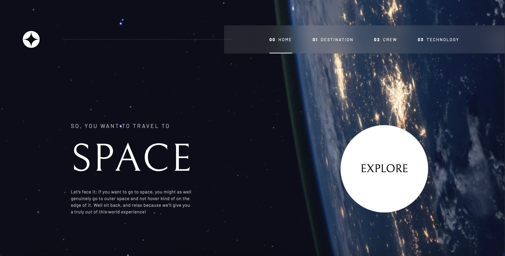

# Frontend Mentor - Space tourism website solution

This is a solution to the [Space tourism website challenge on Frontend Mentor](https://www.frontendmentor.io/challenges/space-tourism-multipage-website-gRWj1URZ3). Frontend Mentor challenges help you improve your coding skills by building realistic projects. 

## Table of contents

- [Overview](#overview)
  - [The challenge](#the-challenge)
  - [Screenshot](#screenshot)
  - [Links](#links)
- [My process](#my-process)
  - [Built with](#built-with)
  - [What I learned](#what-i-learned)
  - [Continuous deployment](#continuous-deployment)
  - [Useful resources](#useful-resources)
- [Author](#author)
- [Acknowledgments](#acknowledgments)


## Overview

### The challenge

Users should be able to:

- View the optimal layout for each of the website's pages depending on their device's screen size
- See hover states for all interactive elements on the page
- View each page and be able to toggle between the tabs to see new information

### Screenshot



This is the screenshot a my home page.

### Links

- Solution URL: [Github URL](https://github.com/florent-augier/space-tourisme-svelte)
- Live Site URL: [Space Tourism](https://space-tourism-svelte.netlify.app/)

## My process
- Explore Figma file in scrimba website "How to build space tourism app" [Scrimba](https://scrimba.com/learn/spacetravel/)
- Choose a SPA framework => SVELTE (because I wanted to learn how it's work)
- Create components: Navbar in first and after all other 

### Built with

- Semantic HTML5 markup
- CSS custom properties
- Flexbox
- CSS Grid
- Mobile-first workflow
- [Svelte](https://kit.svelte.dev) - JS library

### What I learned

I learned that Svelte (JS framework) it's not very difficult to learn. I manage component with "svelte:component" method in ".Svelte" files.

To see how you can add code snippets, see below:

```html
<svelte:component
		this={selected.component}
		on:navigate={handleNavigation}
	/>
```

```js
	$: selected = navOptions[0];
```

### Continuous deployment

- [Netlify](https://www.netlify.com) - Netlify is a powerful JS based Host to deploy your site simply with connecting your "main" branch of your repository with it. All commit in "main" branch will create new version of your live website.


### Useful resources

- [Svelte](https://kit.svelte.dev) - JS library for building SPA.

- [Redirection Netlify](https://docs.netlify.com/routing/redirects/#syntax-for-the-netlify-configuration-file) - Docs for redicting your website

- [100vh handling](https://dev.to/admitkard/mobile-issue-with-100vh-height-100-100vh-3-solutions-3nae) - The possible ways to handle the viewport height with javascript

## Author

- Website - [flowww-dev](https://www.flowww-dev.com)
- Frontend Mentor - [@florent-augier](https://www.frontendmentor.io/profile/florent-augier)


## Acknowledgments

I thanks to scrimba for very useful course and solution for this website.
